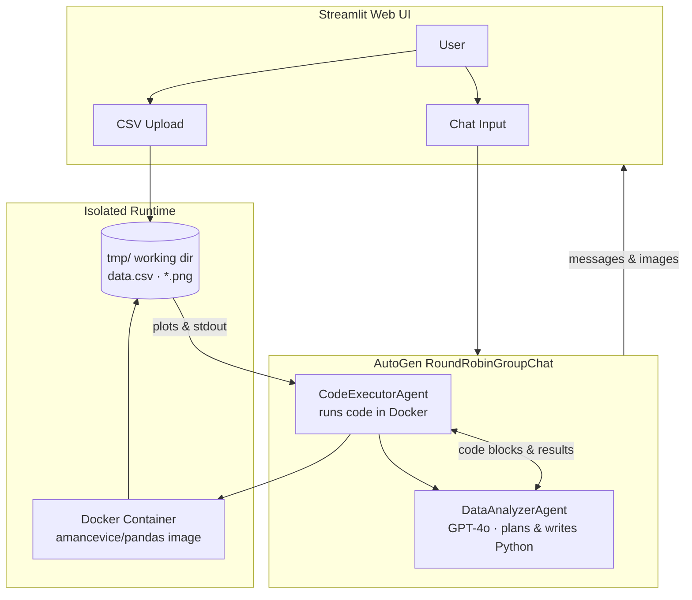
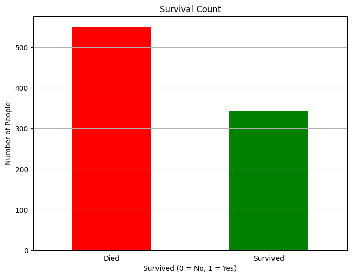

# AnalyserGPT — AI-Powered Data Analyzer

[](https://www.python.org/)
[](https://streamlit.io/)
[](https://github.com/microsoft/autogen)
[](https://openai.com/)
[](https://www.docker.com/)

**AnalyserGPT** is a conversational data-analysis assistant. Upload a CSV, ask questions in plain English, and a multi-agent system plans analysis, writes Python, runs it in an isolated Docker container, and returns insights—including saved charts you can view in the app.

🔗 **Live repo:** [github.com/Geekynerd1605/AnalyserGPT](https://github.com/Geekynerd1605/AnalyserGPT)

---

## Problem Statement

Exploratory data analysis often requires switching between spreadsheets, notebooks, and ad-hoc Python scripts. Analysts and learners spend time on boilerplate—loading CSVs, picking libraries, debugging environment issues, and wiring plots—instead of answering the actual question.

**AnalyserGPT** addresses this by:

- Accepting **natural-language questions** about uploaded CSV data
- Using an **LLM agent** to plan analysis and generate Python code
- Executing code **safely in Docker** so arbitrary analysis does not run on the host machine
- Surfacing **text answers and visualizations** (all generated `*.png` files) in a polished **Streamlit** chat UI

The goal is to make data exploration faster, safer, and more accessible—especially for guided learning and portfolio demonstrations.

---

## Architecture



**Flow (high level)**

1. User uploads a CSV and sends a chat message (e.g. *“Plot sepal length vs petal length colored by variety”*).
2. **DataAnalyzerAgent** explains a plan, emits Python (or shell for `pip install`) in fenced blocks.
3. **CodeExecutorAgent** runs that code inside **Docker** with `tmp/` mounted as the working directory.
4. Agents iterate until the analyzer emits **STOP** (termination condition).
5. Streamlit displays the conversation, generated charts in-thread, and chart download buttons.

---

## Tech Stack

| Layer | Technology |
|--------|------------|
| **UI** | [Streamlit](https://streamlit.io/) |
| **Multi-agent orchestration** | [Microsoft AutoGen](https://github.com/microsoft/autogen) (`autogen-agentchat`, `autogen-ext`) |
| **LLM** | OpenAI **GPT-4o** via `OpenAIChatCompletionClient` |
| **Code execution** | `DockerCommandLineCodeExecutor` (sandboxed) |
| **Runtime image** | `amancevice/pandas` (pandas, numpy, matplotlib-friendly) |
| **Data / viz** | pandas, matplotlib, seaborn (installed in container as needed) |
| **Evaluation (Phase A)** | Local eval runner (`evals/runner.py`) with benchmark cases, artifact logging, and summary reports |
| **Config** | `python-dotenv`, environment variables |
| **Infra** | Docker Engine |

---

## Sample Output

**User question (example):**  
*"Create a bar chart showing survival counts from the dataset."*

**Agent behavior:** The Data Analyzer plans the steps, generates Python with `matplotlib` using the `Agg` backend, saves `output.png` in the working directory, and summarizes findings before signaling `STOP`.

**Generated chart (example):**



**Example console-style exchange (abbreviated):**

```
User: Can you give me a graph of flowers in my data iris.csv?

Data Analyzer: I'll load data.csv, explore columns, then create a scatter plot...
[Python code block → executed in Docker]

Code Executor: Execution successful. Saved output.png
...
Data Analyzer: The plot shows three varieties with distinct petal/sepal clusters. STOP
```

---

## Screenshots

[Home screen](docs/screenshots/01-home.png)
[Analysis in progress](docs/screenshots/03-analysis.png)
[Chart result](docs/screenshots/04-chart.png)


> **Tip:** Run `streamlit run streamlit_app.py`, use a sample CSV (`iris.csv` is included), and take screenshots at 1280×720 or wider for a clean README.

---

## Project Structure

```
AnalyserGPT/
├── streamlit_app.py          # Streamlit UI & async team runner
├── main.py                   # CLI entry for testing the agent team
├── agents/
│   ├── data_analyzer_agent.py
│   ├── code_executor_agent.py
│   └── prompts/data_analyzer_message.py
├── teams/analyzer_gpt.py     # RoundRobinGroupChat wiring
├── config/
│   ├── constants.py          # model name, Docker timeout, work dir
│   └── docker_util.py        # Docker executor lifecycle
├── models/openai_model_client.py
├── evals/
│   ├── runner.py             # Phase A eval runner
│   ├── schema.py             # Pydantic eval-case schema
│   ├── README.md             # eval usage docs
│   └── cases/
│       └── phase_a_cases.json
├── eval_runs/                # generated per-run eval artifacts (created after running evals)
├── docs/
│   ├── assets/sample-output.png
│   └── screenshots/          # add your UI screenshots here
├── iris.csv                  # sample dataset
├── requirements.txt
└── .env.example
```

---

## Getting Started

### Prerequisites

- Python **3.10+**
- [Docker Desktop](https://www.docker.com/products/docker-desktop/) (daemon running)
- [OpenAI API key](https://platform.openai.com/api-keys)

### Installation

```bash
git clone https://github.com/Geekynerd1605/AnalyserGPT.git
cd AnalyserGPT

python -m venv .venv
source .venv/bin/activate   # Windows: .venv\Scripts\activate

pip install -r requirements.txt
```

### Configuration

```bash
cp .env.example .env
# Edit .env and set OPENAI_API_KEY=sk-...
```

`WORK_DIR_DOCKER` in `config/constants.py` resolves automatically to the project `tmp/` folder.

### Run the app

```bash
streamlit run streamlit_app.py
```

1. Upload a **CSV** file.
2. Type your question in the chat box.
3. Wait for agents to finish; generated charts (`*.png`) appear in the chat with download buttons.

### Run evaluation layer (Phase A)

```bash
python3 evals/runner.py
```

Optional flags:

```bash
python3 evals/runner.py --max-cases 1
python3 evals/runner.py --cases-file evals/cases/phase_a_cases.json
```

Eval outputs are written to:

- `eval_runs/<timestamp>/cases/*.json` (per-case artifacts)
- `eval_runs/<timestamp>/summary.json`
- `eval_runs/<timestamp>/summary.md`

### CLI test (optional)

```bash
python main.py
```

---

## Credits & Acknowledgments

> This project was built as part of a **guided learning program by Krish Naik Academy**. The architecture and agent patterns follow the course curriculum; implementation, UI, and extensions are my own work.

| Role | Name / Link |
|------|-------------|
| **Guided project / course** | _Mayank Aggarwal_ |
| **Original concept & walkthrough** | _Mayank Aggarwal_ |
| **Libraries** | [Microsoft AutoGen](https://github.com/microsoft/autogen), (https://microsoft.github.io/autogen/stable//index.html), [Streamlit](https://streamlit.io/), [OpenAI](https://openai.com/) |
| **Author** | [Geekynerd1605](https://github.com/Geekynerd1605) |
